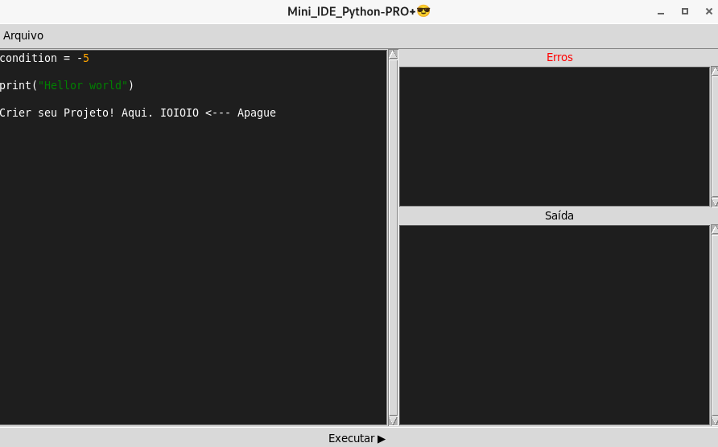
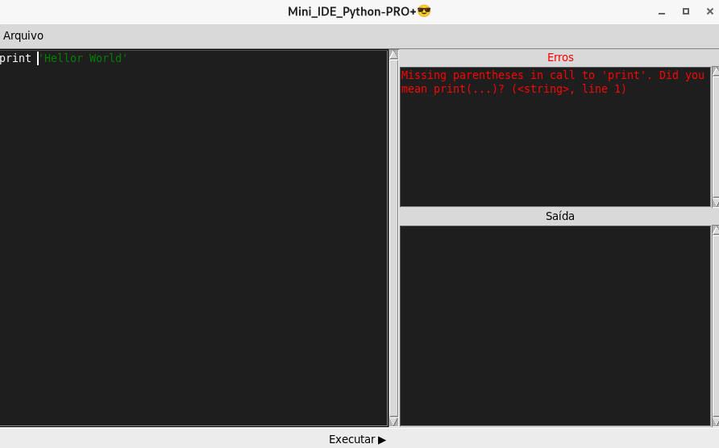
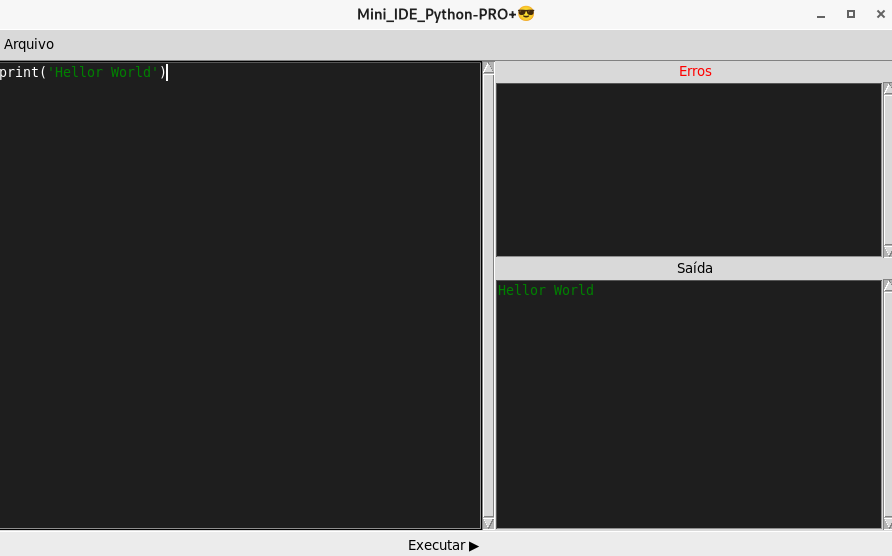

# Mini IDE em Python

Mini IDE em Python é um projeto simples criado com o objetivo de aprender e explorar como funcionam editores de código e ferramentas de desenvolvimento.

A ideia é construir uma IDE leve, funcional e totalmente feita em Python, focada em prática, aprendizado e evolução ainda colocarei mas coisas em brever.

---

## 🚀 Como usar

No Linux (ou terminal):

```bash## 📸 Preview
python3 mini_ide-0.1.py


## 📸 Preview



## 📸 Preview



## 📸 Preview


