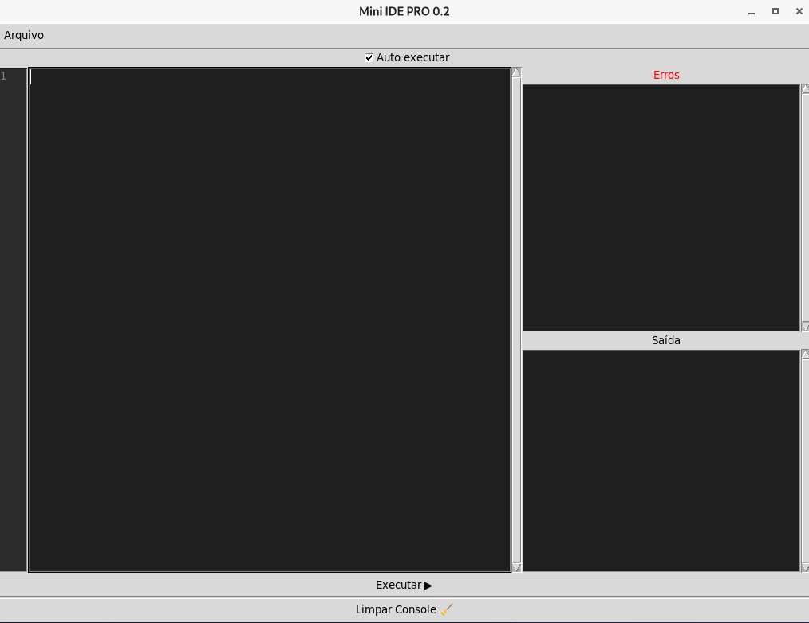
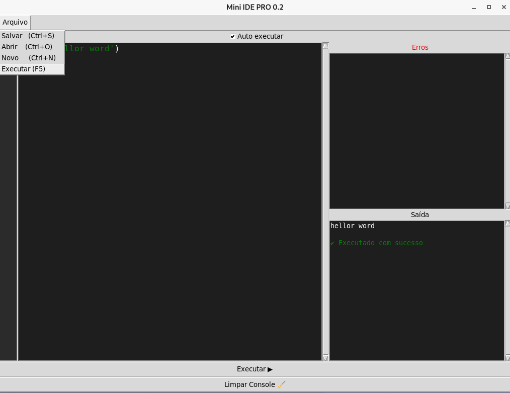
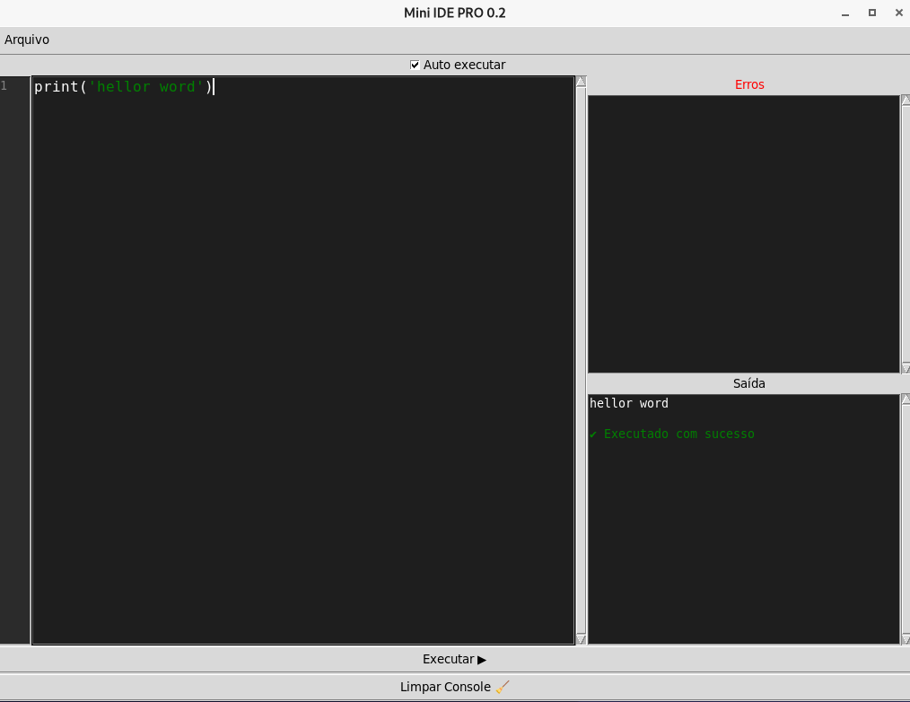
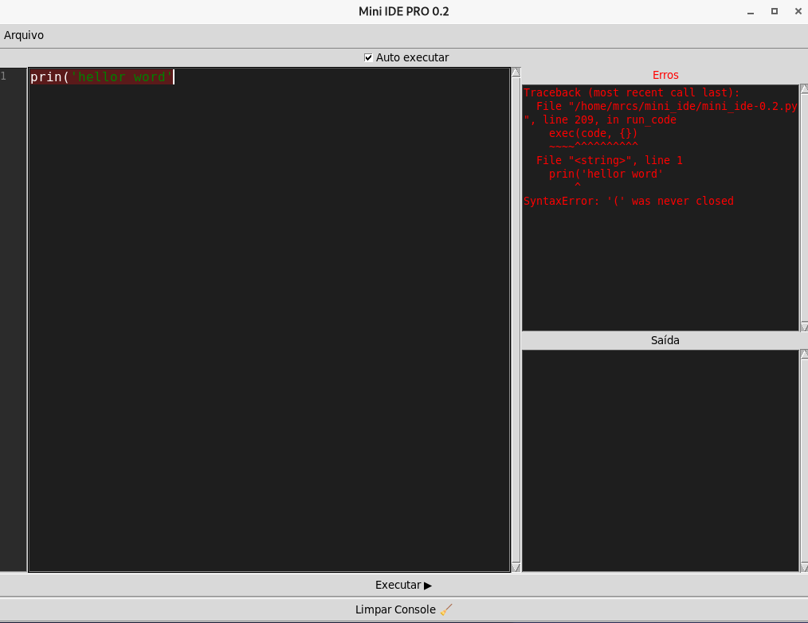

# Mini IDE em PHYTON

Uma mini IDE desenvolvida em Python utilizando Tkinter, criada com o objetivo de aprender na prática como funcionam editores de código e ferramentas de desenvolvimento.

O projeto começou simples e está evoluindo aos poucos, adicionando recursos reais de uma IDE, com foco em aprendizado, organização e experiência do usuário.

🤝 Contribuições

Sugestões, ideias e melhorias são muito bem-vindas!

Se você tiver alguma dica para melhorar o projeto, fique à vontade para abrir uma criticar ou enviar uma sugestão estou a disposto a recebelos Lá ele.

Caso queira contribuir diretamente com código, também será um prazer faço apenas por ROBIHOOD kkk😊

🙌 Créditos e agradecimentos

Este projeto foi desenvolvido por mim MR_PHYTONZINHO não é meu nome real ok, com foco em aprendizado,Pois não achei um IDE bom para o que eu estava precissando.

💬 Observação

Se você contribuir com algo como = (ideia, correção ou melhoria), posso adicionar seu nome FAKE ou REAL nos créditos do projeto se tiver ok para vcs.

## 📸 Versão mini_ide-V0.2 
Nova versão com recurso add e ALTOMATICO CODIGO:

### Tela Princiapl


### Botão Arquivos


### Executando código -BOM-


### Executando código -ERRO-



## 🚀 Como usar
📋 Requisitos
Ter o Python 3 instalado no sistema
Ter suporte ao Tkinter (geralmente já vem com o Python)

Para exercutar o projeto 
No terminal LINUX:

python3 mini_ide-V0.2.py

## 📥 Download

⚠️ Não baixe pelo botão verde

🚀 Versão atual:
- [⬇️ Mini IDE v0.2](https://github.com/MR-PHYTOZINHO/Mini_Ide-Basico-em-Python/releases/download/V0.2/mini_ide-V0.2.py) mini_ide-V0.2


## 📸 Preview mini_ide-0.1

### Interface Mini IDE V0.1


### Executando código -ERROR-


### Executando código -BOM-


---

## mini_ide-V0.1
version: v0.1
Titulo: Mini IDE v0.1
Descricao: Primeira versão da Mini IDE
- Editor básico
- Abrir e salvar arquivos

### Download:
📦 Versões anterio:
- [Mini IDE v0.1](https://github.com/MR-PHYTOZINHO/Mini_Ide-Basico-em-Python/releases/download/V0.1/mini_ide-0.1.py)

## 🚀 Como usar

No seu Linux terminal:

```bash## 📸 Preview
python3 mini_ide-0.1.py
